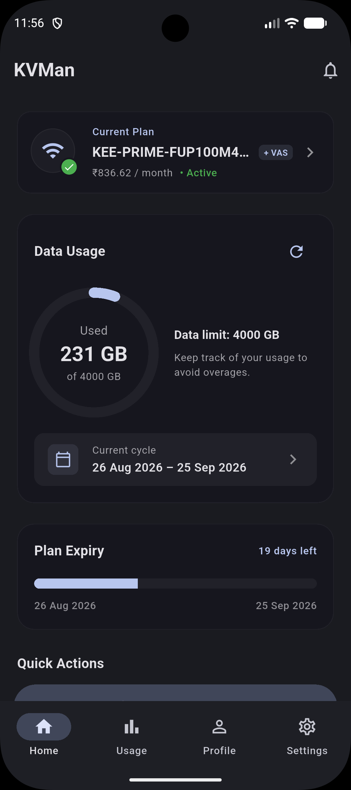
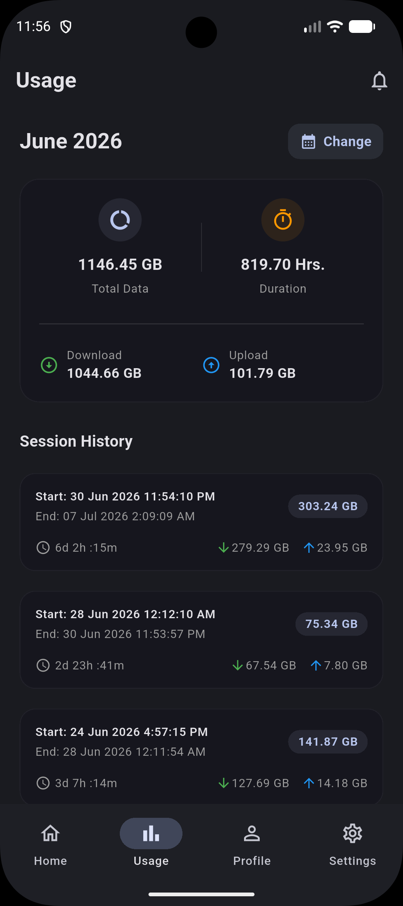
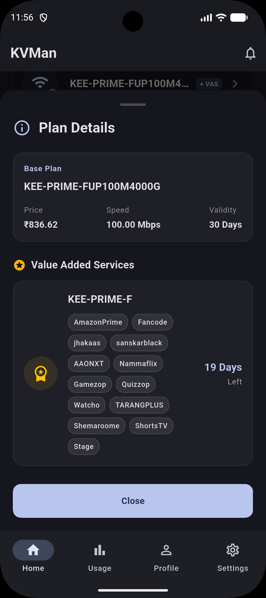
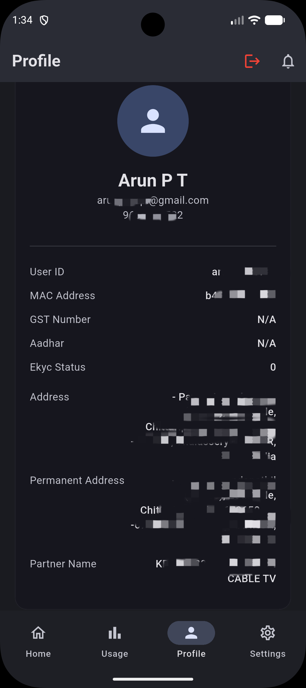
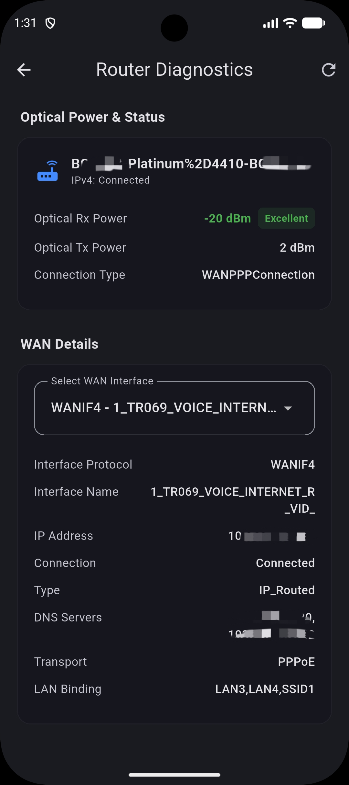
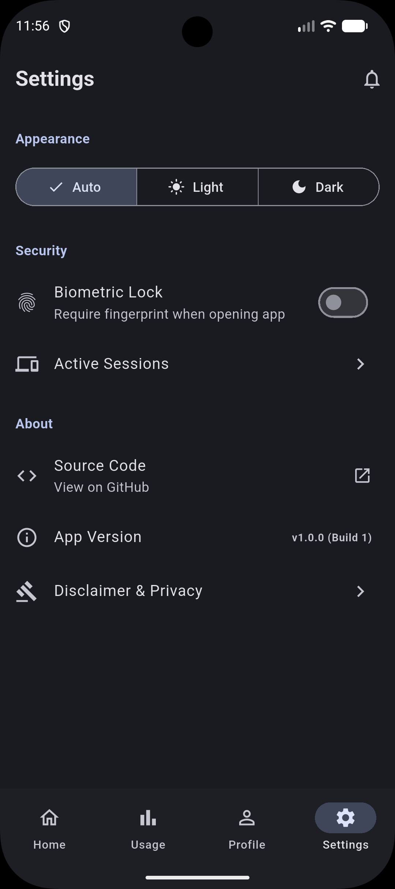

# KVMan

*An unofficial, open source, minimalist third-party client for Kerala Vision broadband users.*

I'm a minimalism enthusiast. I strongly dislike cluttered, slow, and overly complicated user interfaces. 

One day, while trying to check my data usage on my internet service provider's official app, I realized just how bloated and sluggish it felt. I've seen developers build beautiful, sleek third-party alternative apps for *other* ISPs, but after searching around, I couldn't find a single one for my specific provider. 

So, I decided to build one myself. I wanted something minimal, fast, and highly tailored to my niche. 

After doing some research and spending time reverse-engineering the official app's undocumented APIs, I put this entire project together over weekends. I'll gladly admit that I leveraged AI to help generate the code so fast, but everything came together flawlessly and exactly as I expected. I absolutely love Google's Material UI, so I used that as the foundation for the design to keep things as clean and responsive as possible. 

The end result is exactly what I wanted. Instead of wading through a cluttered interface, I can now open the app, unlock it seamlessly with my fingerprint, and instantly see my data limits on a clean dashboard. I even added the ability to hot-swap between multiple accounts and remotely kick devices off my active sessions.

### A Look Inside

<p align="center">
  
  
  
</p>
<p align="center">
  
  
  
</p>

> [!WARNING]
> **A Quick Legal Note**
> Because this was built by reverse-engineering a private API, I have to be crystal clear: **this is an unofficial, third-party application built strictly for educational purposes.** It utilizes read-only functionalities to simply improve ease of use for end-users. I am NOT affiliated with, endorsed by, sponsored by, or in any way officially connected to Kerala Vision, KCCL, or any related internet service provider. All product and company names, logos, and brands are the property of their respective owners. This software is provided "as is", without warranty of any kind, and you use it entirely at your own risk. The goal here is a better UI, nothing malicious. 

### Want to try it?

**For Everyday Users:**
1. Head over to the **Releases** tab on this GitHub repository.
2. Download the latest `.apk` file.
3. Install it on your Android device and enjoy a cleaner experience!

**For Developers:**
If you want to compile this yourself, keep in mind that I purposely did not hardcode the private backend URLs to protect the API. You'll need to set up the environment first:

1. **Clone the repo:** 
   ```bash
   git clone https://github.com/arunpt/kvman.git
   ```
2. **Set up your variables:** Create a `.env` file in the root directory and add the following endpoints:
   ```env
   KV_BASE_URI=
   KV_PORTAL_API_PATH=
   KV_SUBSCIBER_API_PATH=
   ```
3. **Run the app:** 
   ```bash
   flutter pub get
   flutter run
   ```

I might update the design in the future based on feedback, but for now, it perfectly scratches my own itch. If you are a developer who loves minimalist design as much as I do, forks and Pull Requests are always welcome. Feel free to contribute!
